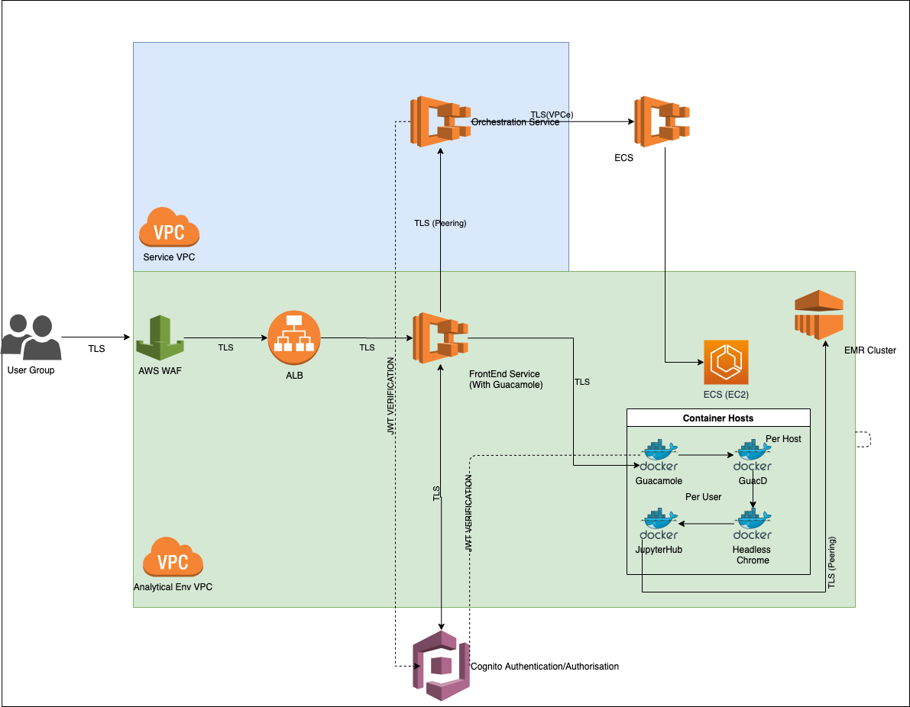

# orchestration-service
The service orchestrator for providing remote access into the analytical environment

###Endpoint ot submit request for user containers 
 Requests using JWT to be submitted as a post request to `/connect`  
 - The JWT should be sent as a string in the header under the key `Authorisation` 
 - The JWT should contain:
    * `cognito:username` or `username` (provided by AWS Cognito)
    * `kmsarn` - the arn number (as a String) that authenticates against their personal S3 storage folder
 
 Test requests that omit JWT to be submitted as a post request to `/deployusercontainers` 
 
 Header of request must contain the following:
  - `Authorisation`*
  - `KmsArn` (for personal S3 folder)
     
  Optional inputs for body of request are:
  - `jupyterCpu`            - default : 512
  - `jupyterMemory `        - default : 512
  - `additionalPermissions`** - default : empty list
  
     \* `Authorisation` field in request header is for JWT String with `/connect` endpoint or a test username (as a String) with `/deployusercontainers` endpoint.
     
     \** `additionalPermissions` should be an array eg. `["s3:List*", "s3:Get*"]`

